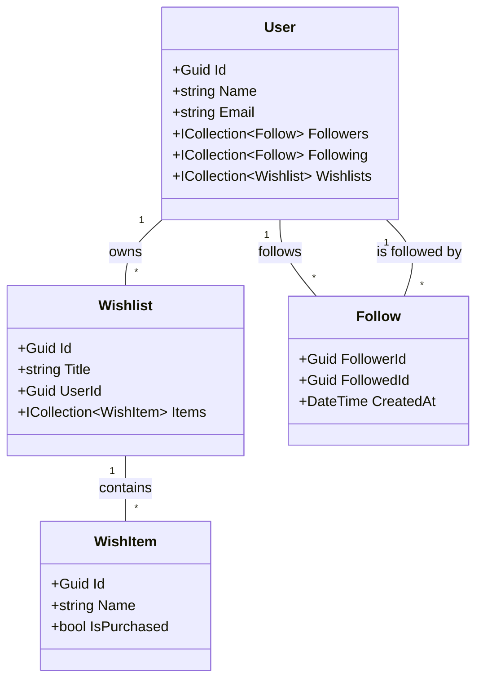
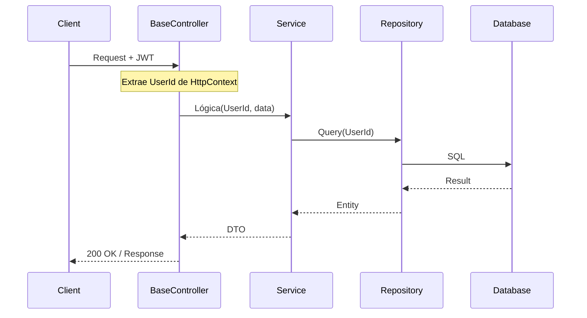

Wisheo Backend 🚀

Wisheo es una plataforma social para gestionar listas de deseos (wishlists) y conectar con amigos. Este backend está construido con una arquitectura robusta en capas, enfocada en la escalabilidad y la seguridad.

🏗 Arquitectura del Sistema

El proyecto sigue el patrón de Arquitectura en Capas:

Controllers: Gestión de endpoints y validación de entrada.

Services: Lógica de negocio y reglas de aplicación.

Repositories: Abstracción de la persistencia de datos (Entity Framework).

Models/Entities: Definición de los datos y sus relaciones.

Diagrama de Clases (UML)

🛠 Stack Tecnológico

Framework: .NET 9

Base de Datos: PostgreSQL

ORM: Entity Framework Core (Code First)

Infraestructura: Docker & Docker Compose

Seguridad: JWT (JSON Web Tokens)

🔒 Seguridad y Contexto de Usuario

Hemos implementado un BaseController personalizado que intercepta el token JWT y expone el UserId de forma segura a todos los controladores protegidos.

Diagrama de Secuencia: Flujo de Petición

📡 Endpoints Principales

Social (Seguidores)

POST /api/social/follow/{id}: Seguir a un usuario.

DELETE /api/social/unfollow/{id}: Dejar de seguir.

GET /api/social/followers: Lista de quiénes me siguen (incluye count).

GET /api/social/following: Lista de a quiénes sigo (incluye count).

Wishlists
POST /api/wishlists: Crear una nueva lista.

GET /api/wishlists: Obtener mis listas.

POST /api/wishlists/{id}/items: Añadir un ítem a una lista.

PATCH /api/wishlists/items/{id}/toggle-purchased: Marcar/desmarcar como comprado.

PUT /api/wishlists/items/{id}: Editar detalle de un ítem.

DELETE /api/wishlists/items/{id}: Eliminar un ítem.

🚀 Instalación y Ejecución
Levantar Base de Datos:

Bash

docker-compose up -d
Aplicar Migraciones:

Bash

dotnet ef database update
Ejecutar App:

Bash

dotnet run
