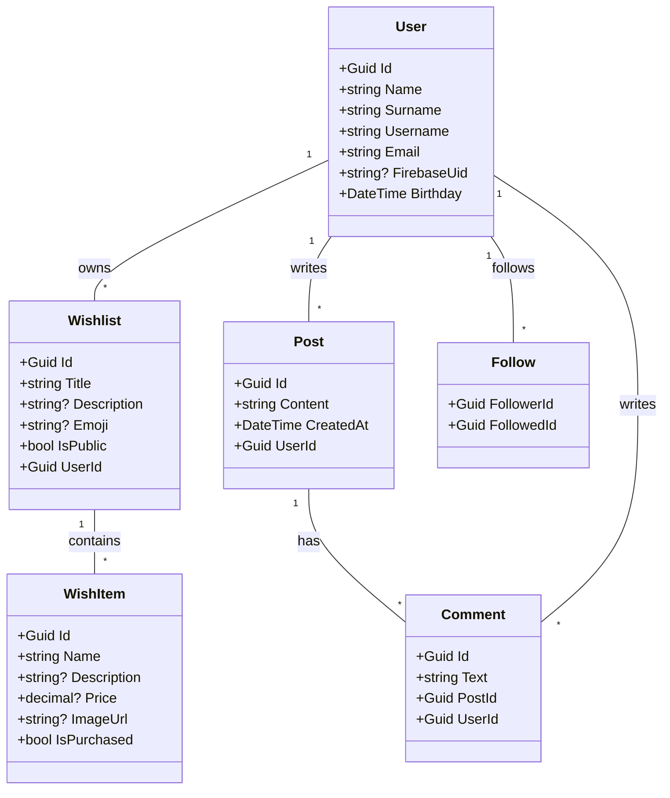
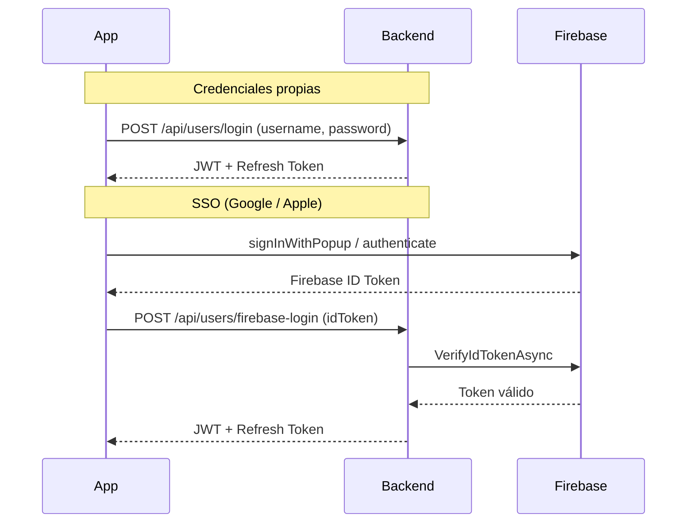

# Wisheo Backend

Wisheo es una plataforma social para gestionar listas de deseos y conectar con amigos. Este backend está construido con .NET 9 siguiendo una arquitectura en capas, con soporte para autenticación propia y SSO mediante Firebase.

## Stack tecnológico

- **Framework:** .NET 9 / ASP.NET Core
- **Base de datos:** PostgreSQL
- **ORM:** Entity Framework Core (Code First)
- **Autenticación:** JWT + Firebase Admin SDK (Google/Apple SSO)
- **Real-time:** SignalR
- **Infraestructura:** Docker & Docker Compose

## Arquitectura

El proyecto sigue el patrón de arquitectura en capas:

```
Controllers  →  Services  →  Repositories  →  Database
```

- **Controllers** — endpoints REST y validación de entrada
- **Services** — lógica de negocio
- **Repositories** — abstracción de persistencia con Entity Framework
- **Models / DTOs** — entidades y objetos de transferencia

### Diagrama de clases


```mermaid
classDiagram
    class User {
        +Guid Id
        +string Name
        +string Surname
        +string Username
        +string Email
        +string? FirebaseUid
        +DateTime Birthday
    }
    class Wishlist {
        +Guid Id
        +string Title
        +string? Description
        +string? Emoji
        +bool IsPublic
        +Guid UserId
    }
    class WishItem {
        +Guid Id
        +string Name
        +string? Description
        +decimal? Price
        +string? ImageUrl
        +bool IsPurchased
    }
    class Post {
        +Guid Id
        +string Content
        +DateTime CreatedAt
        +Guid UserId
    }
    class Comment {
        +Guid Id
        +string Text
        +Guid PostId
        +Guid UserId
    }
    class Follow {
        +Guid FollowerId
        +Guid FollowedId
    }

    User "1" -- "*" Wishlist : owns
    Wishlist "1" -- "*" WishItem : contains
    User "1" -- "*" Post : writes
    Post "1" -- "*" Comment : has
    User "1" -- "*" Comment : writes
    User "1" -- "*" Follow : follows
```

### Flujo de autenticación


```mermaid
sequenceDiagram
    participant App
    participant Backend
    participant Firebase

    Note over App,Backend: Credenciales propias
    App->>Backend: POST /api/users/login (username, password)
    Backend-->>App: JWT + Refresh Token

    Note over App,Backend: SSO (Google / Apple)
    App->>Firebase: signInWithPopup / authenticate
    Firebase-->>App: Firebase ID Token
    App->>Backend: POST /api/users/firebase-login (idToken)
    Backend->>Firebase: VerifyIdTokenAsync
    Firebase-->>Backend: Token válido
    Backend-->>App: JWT + Refresh Token
```

## Endpoints principales

### Autenticación
| Método | Ruta | Descripción |
|--------|------|-------------|
| POST | `/api/users/register` | Registro con credenciales |
| POST | `/api/users/login` | Login con username y contraseña |
| POST | `/api/users/firebase-login` | Login / registro con Firebase SSO |
| POST | `/api/users/refresh` | Renovar access token |
| PATCH | `/api/users/me` | Actualizar perfil |

### Wishlists
| Método | Ruta | Descripción |
|--------|------|-------------|
| GET | `/api/wishlists` | Obtener wishlists del usuario |
| POST | `/api/wishlists` | Crear wishlist |
| PUT | `/api/wishlists/{id}` | Editar wishlist |
| DELETE | `/api/wishlists/{id}` | Eliminar wishlist |
| POST | `/api/wishlists/{id}/items` | Añadir item |
| PUT | `/api/wishlists/items/{id}` | Editar item |
| DELETE | `/api/wishlists/items/{id}` | Eliminar item |
| PATCH | `/api/wishlists/items/{id}/toggle-purchased` | Marcar/desmarcar como reservado |

### Social
| Método | Ruta | Descripción |
|--------|------|-------------|
| POST | `/api/social/follow/{id}` | Seguir usuario |
| DELETE | `/api/social/unfollow/{id}` | Dejar de seguir |
| GET | `/api/social/followers` | Mis seguidores |
| GET | `/api/social/following` | A quién sigo |

### Feed y posts
| Método | Ruta | Descripción |
|--------|------|-------------|
| GET | `/api/feed` | Feed personalizado |
| POST | `/api/posts` | Crear post |
| POST | `/api/posts/{id}/comments` | Comentar en un post |

## Instalación y ejecución

### Requisitos
- .NET 9 SDK
- PostgreSQL (o Docker)
- `dotnet-ef` tool

### 1. Levantar la base de datos

```bash
docker-compose up -d
```

### 2. Configurar secrets locales

```bash
dotnet user-secrets set "ConnectionStrings:DefaultConnection" "Host=localhost;Port=5433;Database=wisheo_db;Username=postgres;Password=TU_PASSWORD"
dotnet user-secrets set "JwtSettings:Secret" "tu_clave_secreta"
dotnet user-secrets set "JwtSettings:Issuer" "wisheo-api"
dotnet user-secrets set "JwtSettings:Audience" "wisheo-app"
```

### 3. Configurar Firebase (SSO)

Descarga la clave de cuenta de servicio desde Firebase Console → Configuración del proyecto → Cuentas de servicio → Generar nueva clave privada, y guárdala como:

```
firebase-service-account.json  ← en la raíz del proyecto (excluido de git)
```

### 4. Aplicar migraciones

```bash
dotnet ef database update --connection "Host=localhost;Port=5433;Database=wisheo_db;Username=postgres;Password=TU_PASSWORD"
```

### 5. Ejecutar

```bash
dotnet run
```

La API estará disponible en `http://localhost:5000`.

## Seguridad

- Las contraseñas se almacenan hasheadas con BCrypt.
- El `firebase-service-account.json` está excluido de git via `.gitignore`.
- Los secrets de configuración se gestionan con `dotnet user-secrets` en local y variables de entorno en producción.
- Todos los endpoints protegidos requieren JWT via header `Authorization: Bearer <token>`.
