Wisheo Backend 🚀 

Wisheo es una plataforma social para gestionar listas de deseos (wishlists) y conectar con amigos. Este backend está construido con una arquitectura robusta en capas, enfocada en la escalabilidad y la seguridad.

 🏗 Arquitectura del Sistema

El proyecto sigue el patrón de Arquitectura en Capas:

Controllers: Gestión de endpoints y validación de entrada.

Services: Lógica de negocio y reglas de aplicación.

Repositories: Abstracción de la persistencia de datos (Entity Framework).

Models/Entities: Definición de los datos y sus relaciones.

Diagrama de Clases (UML)


 🛠 Stack Tecnológico

Framework: .NET 9

Base de Datos: PostgreSQL

ORM: Entity Framework Core (Code First)

Infraestructura: Docker & Docker Compose

Seguridad: JWT (JSON Web Tokens)

 🔒 Seguridad y Contexto de Usuario

Hemos implementado un BaseController personalizado que intercepta el token JWT y expone el UserId de forma segura a todos los controladores protegidos.

Diagrama de Secuencia: Flujo de Petición


Diagrama de Secuencia: Feed

```mermaid
graph TD
    A[Inicio: GetFeed] --> B{¿Usuario Logueado?}
    B -- No --> C[AnonymousFeed]
    B -- Sí --> D[FullFeed]

    subgraph Fuentes de Datos
        E[FeedRepository: Actividad Global]
        F[Hardcoded: Sugerencias]
        G[PostRepository: Posts de Seguidos]
    end

    C --> E
    C --> F

    D --> E
    D --> F
    D --> G

    E & F & G --> H[Empaquetar en FeedItemDto polimórfico]
    H --> I[Ordenar por CreatedAt DESC]
    I --> J[Fin: Enviar Lista al Cliente]
```



Diagrama de flujo de notificaciones (SignalR)

```mermaid
sequenceDiagram
    participant U as Usuario A (Autor)
    participant C as PostsController
    participant S as SocialService
    participant H as SocialHub (SignalR)
    participant F as Usuario B (Seguidor)

    U->>C: POST api/posts (Contenido)
    C->>C: Guardar Post en DB
    C->>S: Obtener lista de Seguidores
    S-->>C: [List de IDs]
    C->>H: Enviar "ReceiveNewPost" a IDs
    H-->>F: Push Notificación (Nuevo Post)
```



 📡 Endpoints Principales

```
POST /api/social/follow/{id}

DELETE /api/social/unfollow/{id}

GET /api/social/followers

GET /api/social/following

POST /api/wishlists

GET /api/wishlists

POST /api/wishlists/{id}/items

PATCH /api/wishlists/items/{id}/toggle-purchased

PUT /api/wishlists/items/{id}

DELETE /api/wishlists/items/{id}

```

 🚀 Instalación y Ejecución

Levantar Base de Datos:

```
docker-compose up -d
```

Aplicar Migraciones:

```
dotnet ef database update
```

Ejecutar App:

```
dotnet run
```
